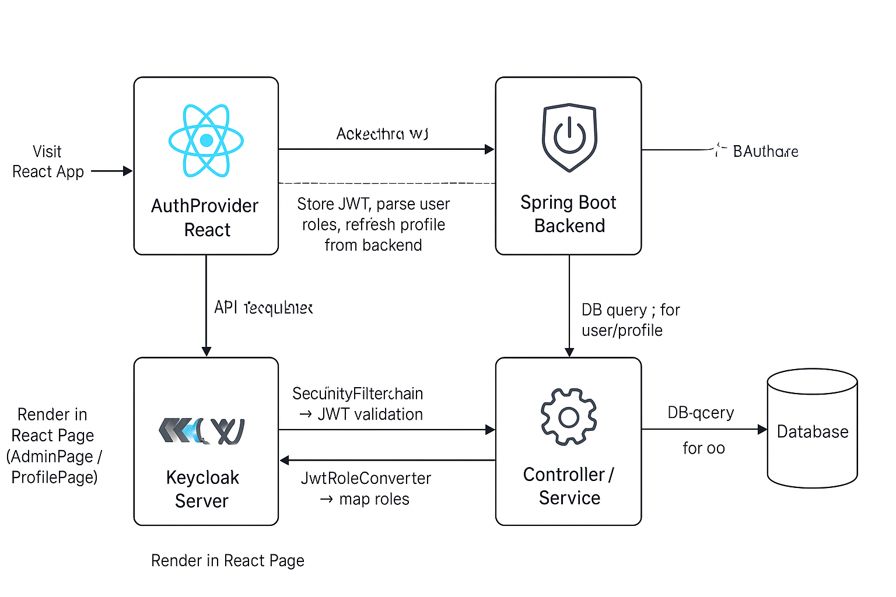

# TrelloLite

## Project Structure
- `frontend/` - React frontend application
- `backend/` - Spring Boot backend application

## Getting Started

### Backend
```bash
cd backend


User (Browser)
  │
  │ Visit React App
  ▼
AuthProvider (React)
  │
  │ Keycloak init → login-required
  ▼
Keycloak Server
  │
  │ Authenticate → issue JWT
  ▼
React App / AuthContext
  │
  │ Store JWT, parse user roles, refresh profile from backend
  ▼
API Request → /auth/admin/dashboard
  │
  │ Attach JWT in the Authorization header
  ▼
Spring Boot Backend
  │
  │ SecurityFilterChain → JWT validation
  │ JwtRoleConverter → map roles
  ▼
Controller / Service
  │
  │ @PreAuthorize checks role
  │ DB query for user/profile
  ▼
Response JSON
  │
  │ Render in React Page (AdminPage / ProfilePage)
  ▼
User sees personalized data



Navigate through menus

